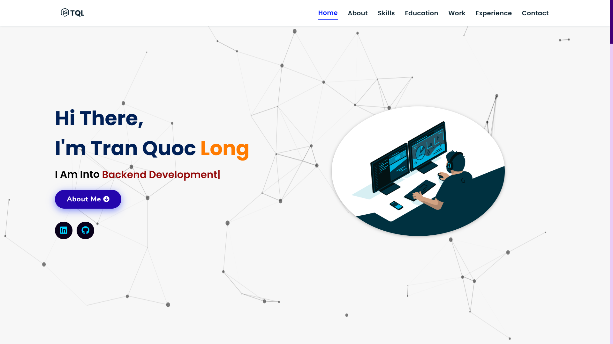

# Portfolio Website

Welcome to my professional portfolio website! This is a modern, interactive personal portfolio showcasing my skills, projects, experience, and education as a Full Stack Developer.



## 📋 Project Overview

This portfolio website is built using modern web technologies and displays:
- **Interactive Home Section** - Landing page with animated particles background
- **About Me** - Personal introduction and professional summary
- **Skills Showcase** - Technical proficiencies including programming languages, frontend, backend, and database technologies
- **Education** - Academic background and qualifications
- **Work Experience** - Professional experience and employment history
- **Projects Portfolio** - Collection of web and mobile development projects
- **Responsive Design** - Fully responsive layout optimized for all devices

## 🎯 Features

- **Dynamic Navigation** - Smooth scrolling navigation bar
- **Animated Background** - Particle animation effects on the home page
- **Project Gallery** - Interactive project showcase with links to live demos and source code
- **Skills Display** - Visual representation of technical skills with icons
- **Mobile Responsive** - Optimized for desktop, tablet, and mobile devices
- **Modern UI/UX** - Clean and professional design with smooth animations
- **404 Error Page** - Custom error page for better user experience

## 🛠️ Tech Stack

### Frontend
- **HTML5** - Semantic markup structure
- **CSS3** - Modern styling with animations and flexbox/grid layouts
- **JavaScript** - Vanilla JavaScript for interactivity and dynamic content
- **Particles.js** - Animated particle background effect

## 📁 Project Structure

```
Portfolio-Website/
├── index.html              # Main portfolio page
├── 404.html               # Error page
├── README.md              # Project documentation
├── skills.json            # Skills data
├── assets/
│   ├── css/
│   │   ├── style.css      # Main stylesheet
│   │   └── 404.css        # Error page styling
│   ├── images/
│   │   ├── educat/        # Education images
│   │   ├── projects/      # Project screenshots
│   │   └── skills/        # Skill icons
│   └── js/
│       ├── app.js         # Main application logic
│       ├── script.js      # Utility scripts
│       ├── 404.js         # Error page script
│       └── particles.min.js # Particle animation library
├── experience/
│   ├── index.html         # Experience page
│   ├── style.css          # Experience page styling
│   └── script.js          # Experience page logic
└── projects/
    ├── index.html         # Projects gallery page
    ├── projects.json      # Projects data
    ├── style.css          # Projects page styling
    └── script.js          # Projects page logic
```

## 🚀 Featured Projects

### Web Applications
- **Weather Forecast** - Real-time weather application with location search and forecast data
- **FlowLite** - Full-featured task management platform for teams and individuals
- **To-Do List** - Task management web app with time-based filters and statistics dashboard
- **Sudoku Solver** - Interactive Sudoku game with authentication and hint system
- **Calculator App** - Simple calculator application with user-friendly interface

## 📱 Responsive Pages

### Home (index.html)
Main landing page with navigation, hero section, and particle animation background.

### Experience (experience/)
Detailed work experience and professional background information.

### Projects (projects/)
Interactive portfolio showcasing all completed projects with descriptions, images, and links.

### 404 Error Page
Custom error handling with navigation back to main site.

## 🎨 Design Highlights

- **Modern Aesthetic** - Clean, professional design with contemporary UI patterns
- **Smooth Animations** - CSS transitions and JavaScript animations for enhanced user experience
- **Color Scheme** - Professional color palette suitable for tech industry
- **Typography** - Readable fonts with proper hierarchy and spacing
- **Accessibility** - Semantic HTML and keyboard navigation support

## 🔗 Links

- **Portfolio Site** - [Visit Portfolio](https://portfolio-jigar-sable.vercel.app)
- **GitHub** - [GitHub Profile](https://github.com/jigar-sable)

## 📧 Contact

Feel free to reach out through the contact links on the portfolio website.

## 📄 License

This project is open source and available under the MIT License.

---

**Last Updated:** January 2026

**Developer:** Quoc Long Tran (TQL)
